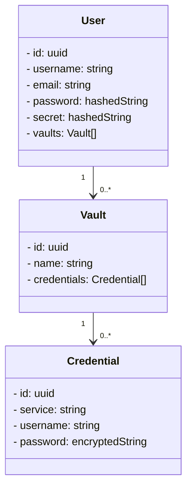

### Class Diagram

```mermaid
    classDiagram
    class User {
        - id: uuid
        - username: string
        - email: string
        - password: hashedString
        - secret: hashedString
        - vaults: Vault[]
    }
    
    class Vault {
        - id: uuid
        - name: string
        - credentials: Credential[]
    }
    
    class Credential {
        - id: uuid
        - service: string
        - username: string
        - password: encryptedString
    }
    
    User "1" --> "0..*" Vault
    Vault "1" --> "0..*" Credential

```
